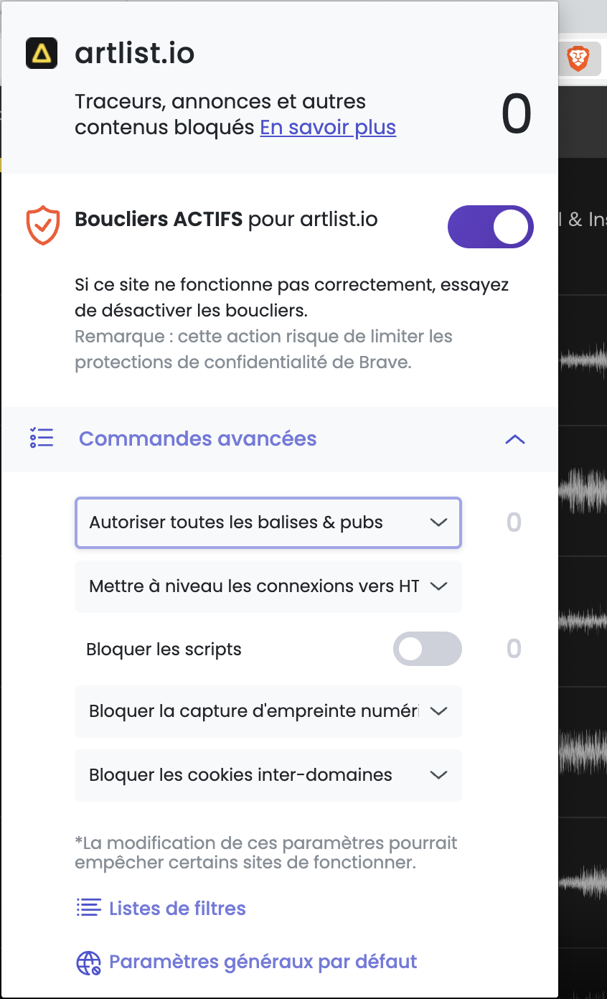

# 🇫🇷 Artlist Downloader
**Artlist Downloader** est une extension pour Chrome et navigateurs basés sur Chromium (MS Edge, Brave, Arc, Opera, ...) L'extension rend facile le téléchargement des fichiers **son** de preview disponibles sur [Artlist](https://artlist.io).

Artlist DL n'apporte aucune nouveauté véritable et redirige simplement l'utilisateur vers des fichiers *fournis côté client*.

## Installation
1. Télécharger la **dernière version** de l'extension dans `Releases` 👉.

2. Dézipper l'archive `.zip` et obtenir un dossier nommé `artlist-dl_version`.

3. Dans Chrome, aller dans `Paramètres > Extensions` **OU** directement via `chrome://extensions`.

4. Activer le "mode développeur", en haut à droite.

5. "Charger l'extension non empaquetée" et choisir le dossier `artlist-dl_version`.

6. Et voilà ! Pour commencer à utiliser Artlist DL, rendez-vous sur [Artlist](https://artlist.io) :)

 

> ### ⚠️ Utilisateurs de Brave
> Le bloqueur de balises tellement efficace de Brave empêche le bon fonctionnement de l'extension. Pour profiter pleinement de sa fonction, un petit ajustement est nécessaire.
> 1. À l'extremité  droite de la barre URL, cliquer sur l'icône "Brave Shields".
> 2. Dans "Commandes avancées", sélectionner "Autoriser toutes les balises et pubs".
> 

 

## Utilisation
Sur [Artlist](https://artlist.io), dans les sections *Music* et *SFX*, faire jouer un son fera automatiquement apparaître un nouveau bouton, en bas à droite, à côté du player. Ce bouton vous redirige vers le fichier audio correspondant (`.aac`), prêt à être téléchargé.

Ces fichiers audio sont des préviews des ressources que propose Artlist. Les sons et musiques sont complets et sans watermark, mais leur qualité n'est évidemment pas identique aux fichiers originaux d'Artlist.

## Rapporter un problème
N'hésitez pas à créer une nouvelle Issue dans l'onglet `Issues` en cas de problème.

## Contributions
- [@Epyi](https://github.com/j4thgit), Thomas Q. - Test & bug find